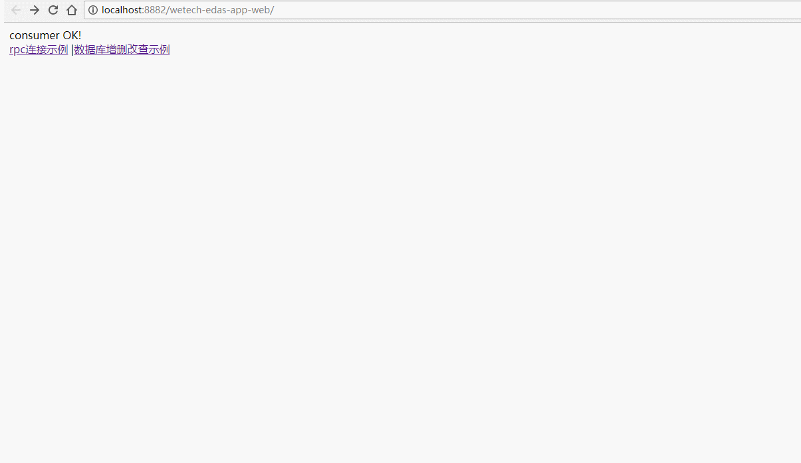

# wetech-dubbo-app

SSM整合dubbo示例工程

## 组织结构

```
wetech-dubbo-parent -- 版本申明管理
├── wetech-dubbo-app-api -- 提供接口定义
├── wetech-dubbo-app-common -- SSM框架公共模块
├── wetech-dubbo-app-service -- 服务提供者应用
└── wetech-dubbo-app-web -- 消费者应用
```

## 模块介绍

- [wetech-dubbo-app](#wetech-dubbo-app)
    - [组织结构](#%E7%BB%84%E7%BB%87%E7%BB%93%E6%9E%84)
    - [模块介绍](#%E6%A8%A1%E5%9D%97%E4%BB%8B%E7%BB%8D)
    - [技术选型](#%E6%8A%80%E6%9C%AF%E9%80%89%E5%9E%8B)
        - [后端技术](#%E5%90%8E%E7%AB%AF%E6%8A%80%E6%9C%AF)
    - [软件需求](#%E8%BD%AF%E4%BB%B6%E9%9C%80%E6%B1%82)
    - [本地部署](#%E6%9C%AC%E5%9C%B0%E9%83%A8%E7%BD%B2)
    - [预览图](#%E9%A2%84%E8%A7%88%E5%9B%BE)
    - [许可证](#%E8%AE%B8%E5%8F%AF%E8%AF%81)
    - [获取源码](#%E8%8E%B7%E5%8F%96%E6%BA%90%E7%A0%81)

> 是所有子模块的父工程，以及版本申明管理，无实质代码

2. wetech-dubbo-app-common

> 公共模块，可以放一些通用工具类

3. wetech-dubbo-app-api

> 提供接口定义

4. wetech-dubbo-app-service

> 服务提供者应用

5. wetech-dubbo-app-web

> 消费者应用

## 技术选型

### 后端技术

技术 | 名称 | 版本 | 官网
----|------|----|----
Spring Framework | IOC容器 | 4.3.5.RELEASE | [http://projects.spring.io/spring-framework/](http://projects.spring.io/spring-framework/)
SpringMVC | MVC框架 | 4.3.5.RELEASE |  [http://docs.spring.io/spring/docs/current/spring-framework-reference/htmlsingle/#mvc](http://docs.spring.io/spring/docs/current/spring-framework-reference/htmlsingle/#mvc)
MyBatis | ORM框架 | 3.2.1 |  [http://www.mybatis.org/mybatis-3/zh/index.html](http://www.mybatis.org/mybatis-3/zh/index.html)
Maven | 项目构建管理 | 4.0.0 |  [http://maven.apache.org](http://maven.apache.org/)
Logback | 日志组件 | 1.1.3 |  [https://logback.qos.ch](https://logback.qos.ch/)
Druid | 数据库连接池 | 0.2.23 |  [https://github.com/alibaba/druid](https://github.com/alibaba/druid)
dubbo | 分布式服务框架 | 2.6.0 |  [https://www.aliyun.com/product/dubbo/](https://www.aliyun.com/product/dubbo/)

## 软件需求

- JDK1.8+
- MySQL5.6+
- Tomcat7.0+/jetty9.0+
- Maven3.0+

## 本地部署

- 通过git下载源码
- 创建数据库wetech_dubbo_app，数据库编码为UTF-8
- 执行docs/sql/init.sql文件，初始化数据
- 修改wetech-dubbo-app-service模块下config.properties文件，更改MySQL账号和密码
- 在项目根模块执行【mvn clean package】
- 启动zookeeper注册中心
- 将wetech-dubbo-app-service模块（服务提供者）和wetech-dubbo-app-web模块（服务调用者）放入tomcat启动！
- 访问http://localhost:8080/wetech-dubbo-app-web 测试服务调用

## 预览图


> 测试服务调用



## 许可证

Wetech-dubbo-app 使用 MIT 许可证发布，用户可以自由使用、复制、修改、合并、出版发行、散布、再授权及贩售wetech-dubbo-app 及其副本。

[查看许可证](LICENSE "LICENSE")

## 获取源码

 [https://github.com/cjbi/wetech-dubbo-app](https://github.com/cjbi/wetech-admin "github")

 [https://gitee.com/cjbi/wetech-dubbo-app](https://gitee.com/cjbi/wetech-admin "gitee")

